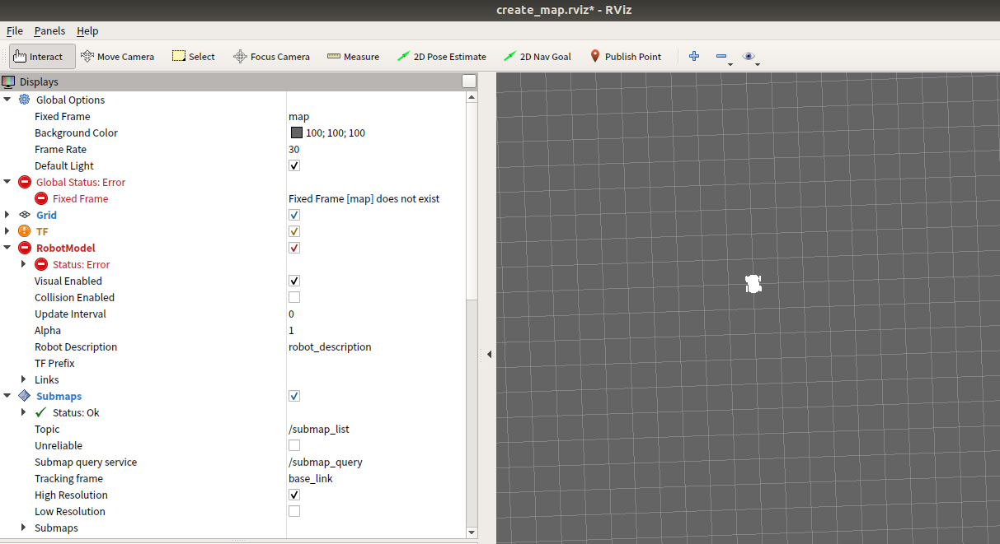
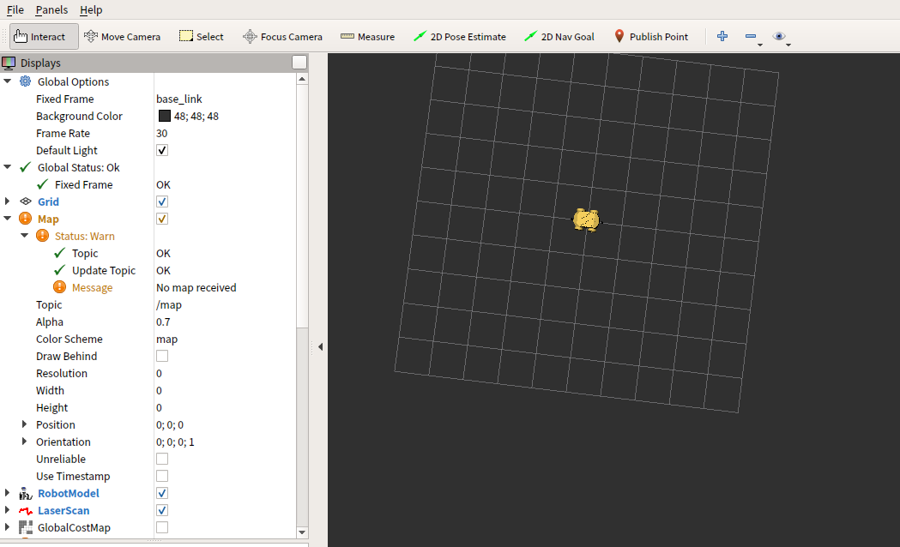
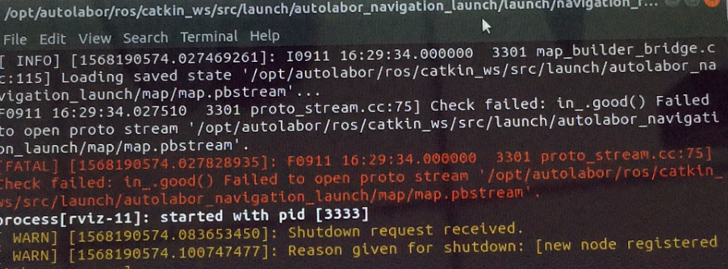
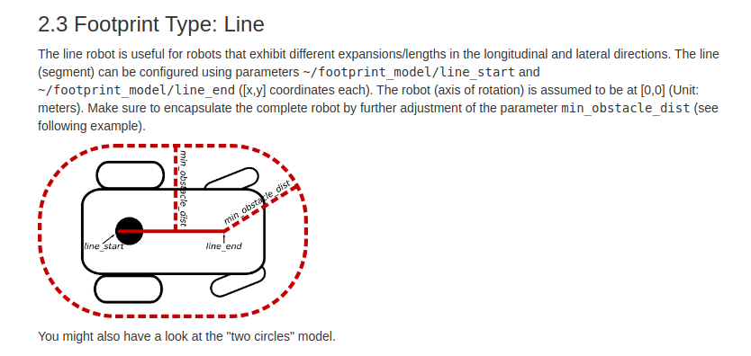
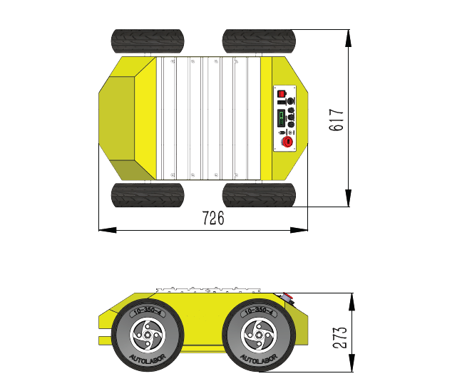
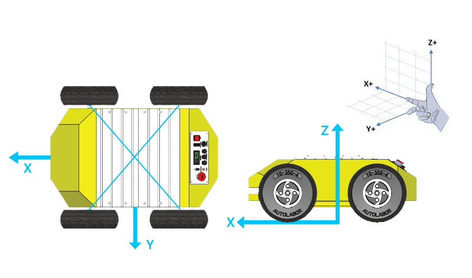

## 常见问题 - 建图导航


### 建图

<a href="/usedoc/navigationKit2/common/q_a/doc2#1">1. 打开开始建图，RVIZ中只有一个白色的车，左侧 RobotModel 报错</a>
<a href="/usedoc/navigationKit2/common/q_a/doc2#2">2. 打开开始建图，RVIZ中只有一个黄色的车，左侧警告 No map receievd</a>
<a href="/usedoc/navigationKit2/common/q_a/doc2#3">3. 键盘控制AP1行走时，AP1动作异常，动一下停一下</a>
<a href="/usedoc/navigationKit2/common/q_a/doc2#4">4. 键盘控制，AP1一动不动</a>
<a href="/usedoc/navigationKit2/common/q_a/doc2#5">5. AP1不受键盘控制、失控</a>
<a href="/usedoc/navigationKit2/common/q_a/doc2#6">6. 如何判断自己的建图质量</a>
<a href="/usedoc/navigationKit2/common/q_a/doc2#7">7. 如何建出高质量的地图/建图效果不佳/地图构建要点</a>
<a href="/usedoc/navigationKit2/common/q_a/doc2#8">8. 建好的地图存放在哪里</a>
<a href="/usedoc/navigationKit2/common/q_a/doc2#9">9. 我有多个环境，地图是否可以保存多个，不用每次重新建图</a>
<a href="/usedoc/navigationKit2/common/q_a/doc2#10">10. 已构建好的地图文件是什么格式，如何对其进行修改</a>
<a href="/usedoc/navigationKit2/common/q_a/doc2#11">11. （接上问）如果一定要手动修改地图，怎么办？</a>

## 导航

<a href="/usedoc/navigationKit2/common/q_a/doc2#nav1">1. 建图完毕后，点击开始导航就会报错</a>
<a href="/usedoc/navigationKit2/common/q_a/doc2#nav2">2. 初始化定位如何完成</a>
<a href="/usedoc/navigationKit2/common/q_a/doc2#nav3">3. 初始化定位一直没有成功，地图和真实环境不符是什么原因</a>
<a href="/usedoc/navigationKit2/common/q_a/doc2#nav4">4. 开始导航后，为什么车走的特别慢，完全走不动的样子</a>
<a href="/usedoc/navigationKit2/common/q_a/doc2#nav5">5. 导航过程中，机器人走的太慢，速度能再快点吗？</a>
<a href="/usedoc/navigationKit2/common/q_a/doc2#nav6">6. （接上问）我一定要提高速度，在哪里改参数？</a>
<a href="/usedoc/navigationKit2/common/q_a/doc2#nav7">7. 导航时，如何调整机器人可通过的宽度/让机器人离障碍物可以更近一点</a>
<a href="/usedoc/navigationKit2/common/q_a/doc2#nav8">8. 机器人导航到达这个目标点是以什么作为参考的呢？这个位置又是如何确定的呢？</a>


***

## 建图导航-建图篇

<h5 id="1">1. 打开开始建图，RVIZ中只有一个白色的车，左侧 RobotModel 报错</h5>



检查紅色急停开关是否右转打开（弹起非按下状态），是否切换到上位机模式。


***

<h5 id="2">2. 打开开始建图，RVIZ中只有一个黄色的车，左侧警告 No map receievd</h5>



1. 停止建图，检查 USB-HUB 的电源线是否插好，数据线是否插在 Mini 计算机的指定接口上
2. 使用雷达测试，查看前后激光雷达数据是否正常
3. 如无有前/后雷达，检查激光雷达是否插在 USB-Hub 上指定的口，前侧雷达插前雷达，后侧雷达插后雷达
4. 检查激光雷达指示灯是否亮着，检查数据线两头是否插紧，拔插数据线，恢复指示灯
5. 打开terminal，执行以下命令内容，查看是否有"box_1"与"box_2"这两个设备

  `$ ll  /dev/box_*`

6. 如以上检查都正常，拔插激光雷达数据线，在 terminal 中执行以下命令内容，将打出日志从后往前翻，查看是否有红色报错，将报错信息截图发送给客服

  `$ dmesg`


***

<h5 id="3">3. 键盘控制AP1行走时，AP1动作异常，动一下停一下</h5>

可调整显示器的位置，保持接收器不被遮挡，并调整自己的位置，使接收器可以接收到发送的指令信号，建议使用USB延长线或USB-HUB将接收器放置在架子的高处，无任何遮挡，便于信号传输。


***

<h5 id="4">4. 键盘控制，AP1一动不动</h5>

a) 确认已将AP1电源总开关打开，红色急停开关没有被按下（右转打开），AP1处于上位机控制模式

b) 新开一个terminal，执行以下命令，打出关系图，查看键盘节点

`$ rosrun rqt_graph rqt_graph`

c) 执行以下命令，上下左右控制键盘看是否会有数据打出，如没有数据打出，说明AP1没有接收到键盘发送的指令

`$ rostopic echo /cmd_vel`

d)执行以下命令，确认event-kbd的数量，数量大于一个则有问题

`ll /dev/input/by-path/ `


e) 请排查是否有多个键盘设备，键盘驱动查找的是最后一个连接的键盘，需要将其他（显示为）键盘的设备找出来，拔掉（可能是鼠标、机械键盘、混装键鼠）


***

<h5 id="5">5. AP1不受键盘控制、失控</h5>

在开始建图前，需要禁用无线功能。如果没有禁用，AP1在连接了WIFI的状态下开始建图，在地图构建过程中，一旦AP1离开无线覆盖区域，无线连接断开，ROS的网络通信中断就会导致AP1控制失控。


***

<h5 id="6">6. 如何判断自己的建图质量</h5>

在构建完成的地图中，如很明显是障碍物（墙）的颜色是虚的，则不太好。


***

<h5 id="7">7. 如何建出高质量的地图/建图效果不佳/地图构建要点</h5>

在构建地图的过程，以下几点会影响到建图的准确性：

* 轮胎气不足影响里程计数据

* 运行速度不宜过快，由于激光扫描有一定的频率，车速低时雷达可以扫描到的点更多，构建的地图会更准确一些

* 走一个来回，增加激光雷达扫描次数，累计更多的数据

* 地图构建的质量也受环境限制，请尽量选择特征比较明显的环境，玻璃、镜子、楼道、空旷等场景会影响建图效果

* 构建完成的地图，会发现有些点会飞出，飞出的点可能是由于物体的表面不平或者有空隙激光直接穿越了过去

* 当场景很大特征不足的时候，需要规划建图路径时，应先走一个小回环，当回环成功后，可以再多走几圈，消除粒子在这个回环的多样性。接下来走下一个回环，直到把整个地图连通成一个大的回环

***

<h5 id="8">8. 建好的地图存放在哪里</h5>

catkin_ws/src/launch/autolabor_navigation_launch/map

***

<h5 id="9">9. 我有多个环境，地图是否可以保存多个，不用每次重新建图</h5>

可以。所有成功保存的地图都会保存在：

`catkin_ws/src/launch/autolabor_navigation_launch/map`


导航时使用的地图文件为`map.pbstream`，最后一次保存的地图会自动存储为`map.pbstream`，而过去建好的地图会用时间戳重命名，备份在同一路径下，备份地图的名称可以自定义。


如果要切换地图，可以将现有地图重命名，将要替换的地图修改为`map.pbstream`，之后需要再次切换的时候，依然更换地图名称即可。


***

<h5 id="10">10. 已构建好的地图文件是什么格式，如何对其进行修改</h5>

SLAM 建图算法使用的是 Cartographer ，地图文件为 pbstream 格式。

pbstream 文件本质上是一个压缩的 protobuf 文件，其中包含 Cartographer 内部使用的数据结构的快照。

>Cartographer can serialize its internal state in a .pbstream file format which is essentially a compressed protobuf file containing a snapshot of the data structures used by Cartographer internally.

由此可知，pbstream 与 ROS格式地图（.pgm+.yaml）不同，pbstream 不可修改编辑。

*** 

<h5 id="11">11. （接上问）如果一定要手动修改地图，怎么办？</h5>

由上问可知 pbstream 是不可编辑的，但如果因为环境的原因，建图效果不是很好，一定要手动修改地图。

有2点要提前知晓：

1. pbstream 格式只能向 ROS 格式地图（.pgm+.yaml）单向转换
2. 导航中定位使用的是 Cartographer 定位，Cartographer 定位是只支持基于 pbstream 格式地图的 pure localization，不接受其他格式的地图。如果要修改地图，就要放弃 Cartographer 定位。

可参考的方案有：

1. 使用 Cartographer 建图，得到 pbstream 文件，转换为ROS格式地图（.pgm+.yaml），手动修改后使用其他定位算法，如AMCL
2. 更换 Cartographer 为 gmapping，得到ROS格式地图（.pgm+.yaml），手动修改后使用其他定位算法，如AMCL


但 gmapping 没有回环检测，建图效果与 Cartographer 比有差距。

请按照各自的需求，来进行决策。


## 建图导航-导航篇

<h5 id="nav1">1. 建图完毕后，点击开始导航就会报错</h5>



1. 查看地图文件是否保存成功

    catkin_ws\src\launch\autolabor_navigation_launch\map\map.pbstream

    是否有 map.pbstream 文件存在，如果没有则没有成功保存地图。

2.  有地图存在，但文件大小较小（不到1MB）

    地图文件不完整，没有正常保存地图。

    建图结束后，不能手动关闭程序/terminal、RVIZ，必须点击图标关闭。


***

<h5 id="nav2">2. 初始化定位如何完成</h5>

控制机器人前后左右转弯即可


***

<h5 id="nav3">3. 初始化定位一直没有成功，地图和真实环境不符是什么原因</h5>

如周围没有明显的特征信息，使得机器人能够找到自己的位置，开到有折角拐弯或明显标志物附近，能够加速机器人找到自己的位置。


***

<h5 id="nav4">4. 开始导航后，为什么车走的特别慢，完全走不动的样子</h5>

给定目标，开始导航后，要按【0】关闭键盘控制。

键盘未关闭，且又不进行任何控制时，键盘程序会一直向底层发送速度0指令。

接到目标点导航任务后，导航程序又一直向底层发布速度指令，2个程序同时发送速度，会导致底层走不动。

***

<h5 id="nav5">5. 导航过程中，机器人走的太慢，速度能再快点吗？</h5>

可以，但机器人行走速度过快，实时雷达数据与环境地图匹配不佳会导致无法正确避障而撞到障碍物。

并且机器人定位异常，会影响导航行走效果。


***

<h5 id="nav6">6. （接上问）我一定要提高速度，在哪里改参数？</h5>

修改以下文件：

`catkin_ws\src\launch\autolabor_navigation_launch\two_laser_navigation_param\teb_local_planner_params.yaml`

```
max_vel_x: 0.2 //机器人的最大平移速度
max_vel_x_backwards: 0.2//当向后移动时，机器人的最大绝对平移速度
max_vel_theta: 0.2//机器人的最大旋转速度
```

修改为
```
max_vel_x: 0.8
max_vel_x_backwards: 0.6
max_vel_theta: 0.6
```

<h5 id="nav7">7. 导航时，如何调整机器人可通过的宽度/让机器人离障碍物可以更近一点</h5>

修改以下文件：

`/src/launch/autolabor_navigation_launch/two_laser_navigation_param/teb_local_planner_params.yaml`

参考下图：





修改以下3个参数：

```
line_start: [-0.3, 0.0] # for type "line"
line_end: [0.3, 0.0] # for type "line"
min_obstacle_dist:0.4
```

具体的数值要按照修改期望与实际环境进行计算，
虚线圈越小，离障碍物就越近，可过的宽度越窄，但不建议修改太小。

***

<h5 id="nav8">8. 机器人导航到达这个目标点是以什么作为参考的呢？这个位置又是如何确定的呢？</h5>

在map坐标系下，机器人base_link坐标系原点，到达目标点位置，即视为到达目标点。

**Autolabor Pro1 base_link坐标系**

以机器人四轮接触面为X-Y平面，四轮轴心连线的点做垂线，与x-y平面的交点为base_link坐标系原点，车头朝向方向为X轴，正左方向为Y轴，向上为Z轴。

