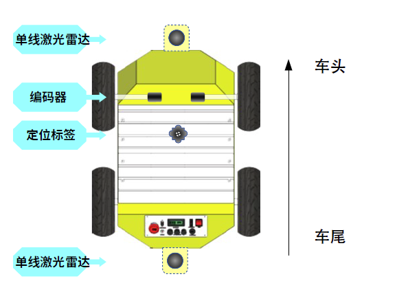

# 定位循迹

## 目录

* 功能介绍
* 传感器介绍
* 实现原理

## 功能介绍

定位循迹是机器人循着用户提前录好的轨迹自主行走，行走过程中机器人能够自动躲避障碍物，自动规划路线，达到目标点。

定位循迹分为定位系统(固定定位标签)与车端（车载定位标签）两个模块，要求先搭建定位系统，然后控制车端完成循迹。

定位系统是使用Dashboard软件+固定定位标签部署地图，在Dashboard中可查看定位标签彼此的距离。

定位系统搭建完毕后，OS程序中可以得到车载定位标签的在环境地图中的绝对定位坐标。

车载定位标签的数据与里程计的数据融合定位，得到AP1在环境中的坐标点，控制AP1运动，边走边记录当前坐标点的位置，将这些坐标点记录为文件保存下来，得到路径文件。

在开始循迹的时候，程序加载路径文件，车载定位标签定位数据与里程计融合定位匹配路径数据，机器人按照指定路径行走。

## 传感器介绍

定位循迹 用到的传感器有：


* 单线激光雷达x2，安装在AP1前后底部
* 车载定位标签，安装在AP1顶板上
* 固定定位标签，部署在循迹环境中
* 编码器/轮速里程计x2，安装在车体内部前侧




## 实现原理


  
| 步骤 | 输入数据  | 操作  |  输出数据 | 使用ROS包 | 
|--|--|--|--|--|
|1 |  | Dashboard部署定位地图 |  定位数据（车载定位标签坐标）| marvelmind驱动包(catkin_ws\src\driver\location\marvelmind)|
|2 | 里程计数据 定位数据 | 定位融合| 当前机器人在环境中的位姿 | location_fusion(catkin_ws\src\navigation\location_fusion)|
|3| 当前机器人位姿| 控制机器人运动，录制路径| 路径数据 |path_server(catkin_ws\src\navigation\path_server)|
|4| 路径数据| 读取录制的路径数据，执行循迹操作 | 目标机器人位姿 |path_server(catkin_ws\src\navigation\path_server)  [move_base](http://wiki.ros.org/move_base/)|
|5| 当前机器人位姿 目标机器人位姿| 根据机器人当前位姿，进行全局规划路线| 路径数据（初步预估导航路线） |[global_planner(dijkstra) ](http://wiki.ros.org/global_planner)|
|6| 路径数据 前雷达数据 后雷达数据 | 根据规划路径开始导航，进行过程中随着实际环境、障碍物变化，进行局部路径规划，实时避障| 局部路径规划  避障 |[costmap_2d ](http://wiki.ros.org/cost_map)[teb_local_planner](http://wiki.ros.org/teb_local_planner)|
|7| 速度信息 /cmd_vel | 向底发送速度命令 |  |[move_base](http://wiki.ros.org/move_base/)|

定位循迹 launch配置示例

```
	<!-- 标签定位与里程计定位融合 -->
    <node name="location_fusion" pkg="location_fusion" type="simple_fusion">
        <param name="map_frame" value="map"/>
        <param name="odom_frame" value="odom"/>
        <param name="tag_frame" value="tag"/>

        <param name="buffer_size" value="50"/>
        <param name="distance_interval" value="0.1"/>
        <param name="rate" value="200"/>
    </node>

    <!-- 录制路径 -->
    <node name="path_saver" pkg="path_server" type="record_path_node">
        <param name="map_frame" value="map"/>
        <param name="base_link_frame" value="base_link"/>
        <param name="odom_topic" value="odom"/>
        <param name="distance_interval" value="0.2"/>
    </node>

    <!-- 加载路径 -->
    <node name="path_loader" pkg="path_server" type="load_path_node">
        <param name="map_frame" value="map"/>
        <param name="path_file" value="default_path"/>
    </node>

    <!-- 导航模块 -->
    <node pkg="move_base" type="move_base" respawn="false" name="move_base" output="screen">
		<rosparam file="$(find autolabor_navigation_launch)/params/navigation/move_base/tracking_move_base.yaml" command="load" />
		<rosparam file="$(find autolabor_navigation_launch)/params/navigation/costmap/two_laser_global_costmap_params_for_tracking.yaml" command="load" ns="global_costmap"/>
		<rosparam file="$(find autolabor_navigation_launch)/params/navigation/costmap/two_laser_local_costmap_params.yaml" command="load" ns="local_costmap"/>
		<rosparam file="$(find autolabor_navigation_launch)/params/navigation/global_planer/tracking_planner_params.yaml" command="load" ns="LoopPathPlanner"/>
		<rosparam file="$(find autolabor_navigation_launch)/params/navigation/local_planer/tracking_teb_local_planner_params.yaml" command="load" ns="TebLocalPlannerROS"/>
    </node>

```