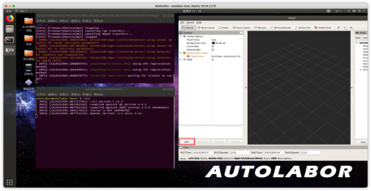
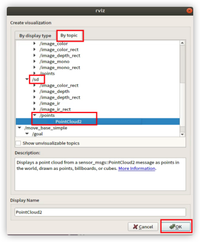
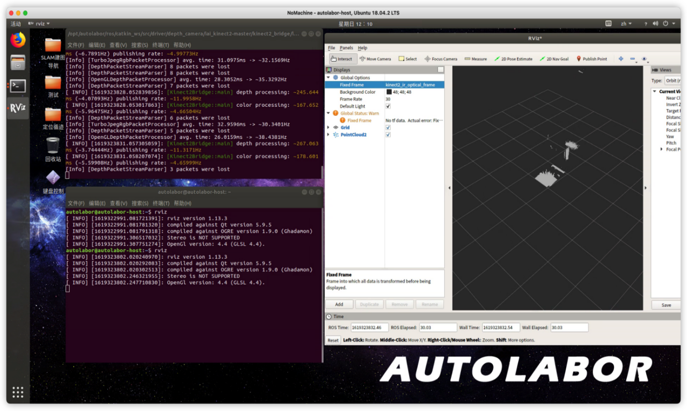
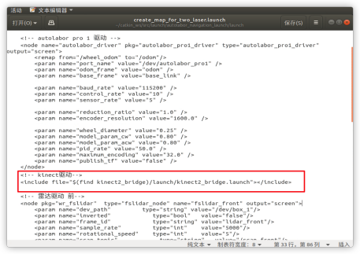

# 启动Kinect ROS驱动

步骤：
* 1.进入工作空间
* 方法：在终端执行cd catkin_ws
* 2.配置环境变量
* 方法：在终端执行source devel/setup.bash
* 3.启动驱动
* 方法：在终端执行roslaunch kinect2_bridge kinect2_bridge.launch

# 查看Kinect RGB图像

<b style="color:red;">前提：启动Kinect ROS驱动</b>

步骤：

1.进入工作空间
方法：在终端执行cd catkin_ws
2.配置环境变量
方法：在终端执行source devel/setup.bash
3.在终端执行命令：rosrun image_view image_view image:=/kinect2/sd/image_color

# 查看Kinect 深度图像

<b style="color:red;">前提：启动Kinect ROS驱动</b>

步骤：

1.打开终端，输入rviz后弹出rviz窗口，点击窗口左下角【add】 

2.点击弹窗中【by topic】- 打开【/kinect2/sd/points】- 选择PointCloud2 -【ok】

3.复制【kinect2_ir_optical_frame】到Global options->Fixed Frame，替换【map】

# 在建图/导航/循迹中打开摄像头（查看周围环境）

<b style="color:red;">以建图为例：</b>

步骤：

1.在建图launch文件里引入深度相机的驱动启动，保存

2.启动建图

rviz里新起一个话题
方法：点击左下角【add】，选择【topic】，选择【/kinect2/hd/image_color】，下拉下来选最后一个，然后ctrl+s保存

# 在建图/导航/循迹中显示深度数据

步骤：

<b style="color:red;">以建图为例：</b>

<b style="color:red;">1.将kinect驱动加载到建图launch文件中（方法同上）</b>

2.rviz里新起一个话题
点击左下角【add】，选择【topic】，选择【/kinect2/sd/image_depth】，下拉下来选最后一个，然后ctrl+s保存

