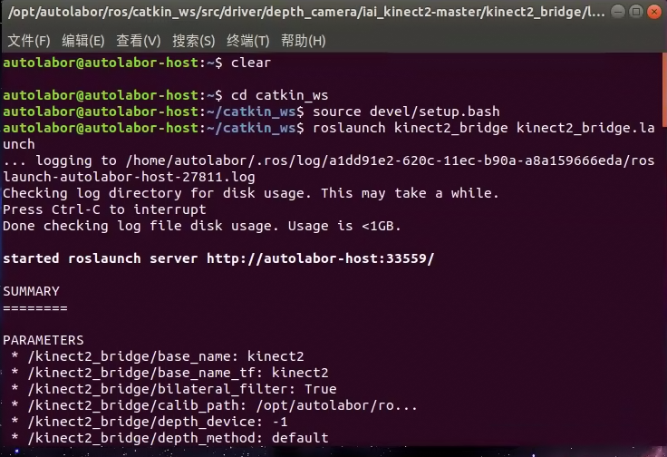
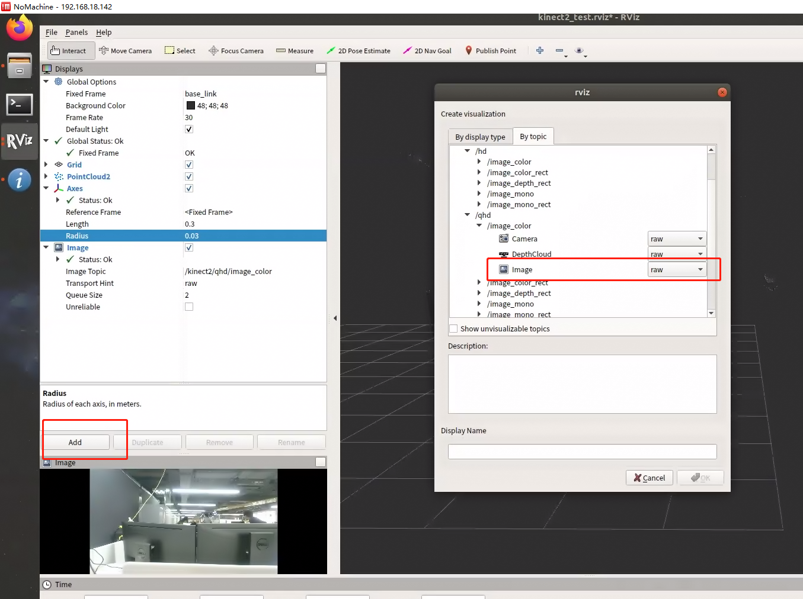
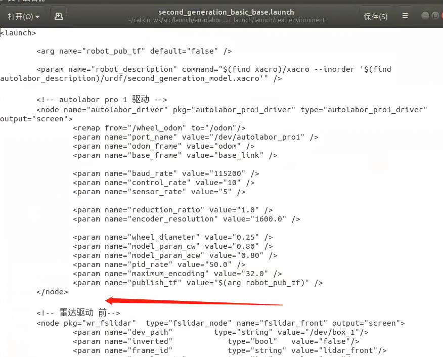

# 使用

## 准备

1. 连接相机的数据线（插在电脑USB3.0口上）与电源线
2. 集线器亮起白色指示灯（说明供电正常）

## 测试

进入桌面 测试 - > kinect2测试


## 启动驱动

步骤：

1.进入工作空间，打开终端执行
	`cd catkin_ws`
2.配置环境变量，在终端执行
	`source devel/setup.bash`
3.启动驱动，在终端执行
	`roslaunch kinect2_bridge kinect2_bridge.launch`



# 查看Kinect RGB图像

步骤：

0.启动驱动

1.打开终端，执行 `rviz` ，打开RViz 

2.添加图像话题
点击左下角 `add`，选择 By topic -> /qhd -> image_color -> Image -> OK ，保存




# 查看Kinect 深度图像

步骤：

0.启动驱动

1.打开终端，执行 `rviz` ，打开RViz 

2.添加深度话题
点击左下角 `add`，选择 By topic -> /qhd -> image_depth -> Image -> OK ，保存


# 在建图/导航/循迹中加入kinect

步骤：

以建图为例：

0.找到launch文件

```
AutolaborOS-2.2.1 及以上系统，文件路径:catkin_ws\src\launch\autolabor_navigation_launch\launch\real_environment

2.2.1 及以上版本，仅需修改*_base.launch文件


AutolaborOS-2.2.1 以下系统，文件路径：catkin_ws\src\launch\autolabor_navigation_launch\launch

2.2.1 以下版本，需要修改对应应用launch文件


OS系统->设置->详细信息可查看系统版本号，如无版本号则为2.2.1以下版本。

```

1.打开launch文件，以【second_generation_basic_base.launch】为例，右键打开编辑




2.将下面内容粘贴至launch文件中，保存，关闭

```
<include file="$(find kinect2_bridge)/launch/kinect2_bridge.launch"></include>
```

3.启动建图

4.添加图像话题

点击左下角 `add`，选择 By topic -> /qhd -> image_color -> Image -> OK ，保存

5.添加深度话题

点击左下角 `add`，选择 By topic -> /qhd -> image_depth -> Image -> OK ，保存


## 话题/Topics

[话题说明](https://github.com/code-iai/iai_kinect2/blob/master/kinect2_bridge/README.md#topics)


