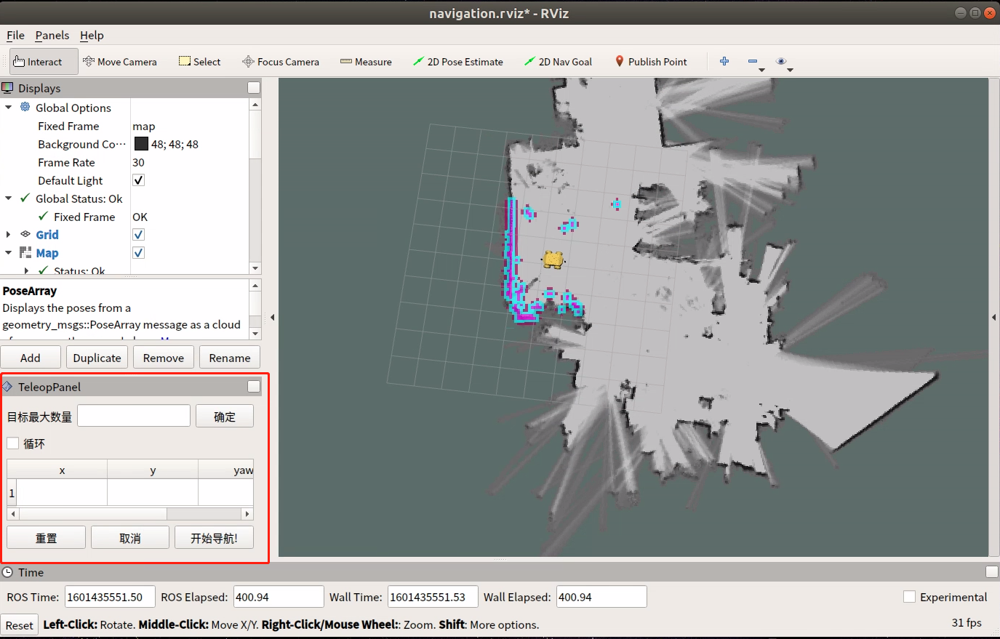
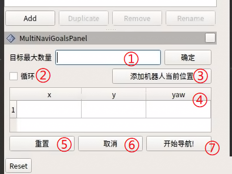
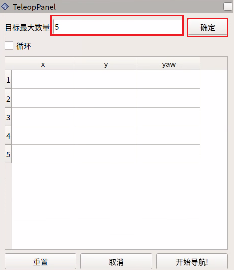
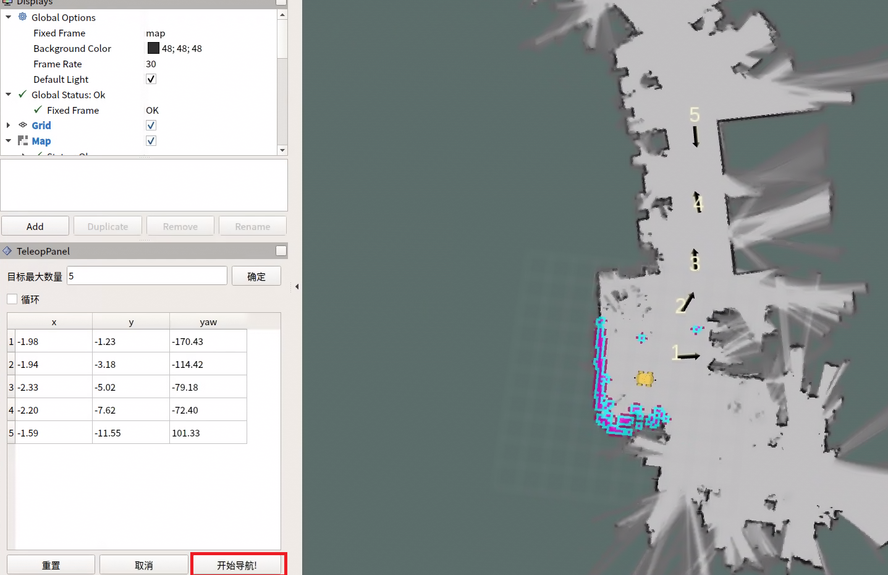
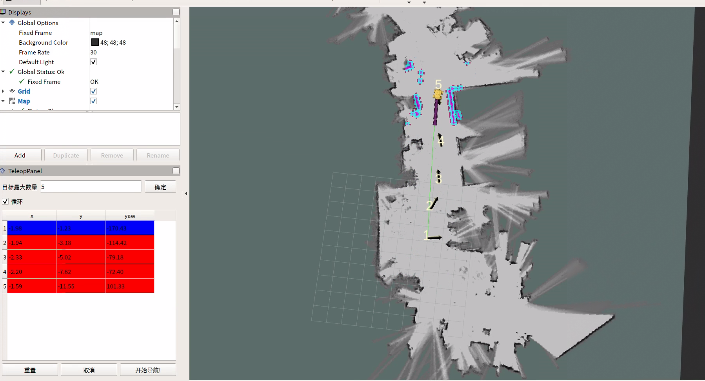
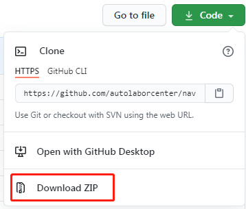

#  SLAM 多点导航


### 功能描述：

在SLAM 导航时提供可发布多个目标点任务的导航方式。


## 适用系统版本

AutolaborOS-2.2.1及以上

注：如是2.2.1以下的版本需要手动下载安装该功能包，安装教程见本文最末。

OS系统->设置->详细信息可查看系统版本号，如无版本号则为2.2.1以下版本。

### 适用功能：

2D SLAM / 3D SLAM

### 要求:

必须基于建图导航使用


### 一、配置


准备工作：启动【开始导航】

**注：要求提前建好地图。**


#### 1. 加载功能包

RViz 的左上角依次点击 Panels -> Add New Panel -> navi_multi_goals_pub_rviz_plugin -> MultiNaviGoalsPanel


<div style="clear: both;"></div>

***

**加载完毕：**




#### 5. 修改配置

***

##### 修改 2D Nav Goal 按钮话题

RViz 的左上角 Panels->Add New Panel-> Tool Property

将 2D Nav Goal -> Topic 修改为 /move_base_simple/goal_temp 


<div style="clear: both;"></div>


***

##### 新增 marker （目标点标记）

RViz 左侧 Display -> add -> Marker


<div style="clear: both;"></div>


***

**做完以上操作后 Ctrl  + S 保存 RViz 配置，如忘记保存，则下次进来要重复操作。**


### 二、使用

### 操作区说明



① 可设置目标点的最大数量：要求所设置目标点个数不能大于该参数（可以小于）

② 是否循环：若勾选，导航至最后一个目标点后，将重新导航至第一个目标点。例：1->2->3->1->2->3->···，该选项必须在开始导航前勾选

③ 添加机器人当前位置：控制机器人运动到目标点，点击该按钮，记录当前位置坐标

④ 任务目标点列表： x/y/yaw，地图上给定目标点的位姿（xy坐标与航向角yaw)。

* 设置完目标最大数量，保存后，该列表会生成对应数量的条目
* 每给出一个目标点，此处会读取到目标点的坐标与朝向

⑤ 重置：将清空当前所有目标点

⑥ 取消：取消当前目标点导航任务，机器人停止运动。再次点击开始导航后，会从下一个任务点开始。

例：1->2->3，在1->2的过程中点击取消，机器人停止运动，点击开始导航后，机器人将从当前坐标点去往3。

⑥ 开始导航：开始任务

### 操作步骤说明

#### 1. 初始化机器人位置

点击开始导航，打开 rviz，使用键盘控制机器人运动，当环境特征与地图匹配完成后，机器人会定位到地图中对应的位置。

#### 2. 设置任务

##### 1) 设置任务目标点个数，点击确认保存




##### 2) 设置目标点


方法一：

控制机器人运动到目标点，点击【添加机器人当前位置】，该坐标被记录下来

方法二：

点击ToolBar上的2D Nav Goal，在地图上给定目标点。（每次设置都需要先点击2D Nav Goal）

目标点有朝向区分，箭头顶端为车头方向。


##### 3) 点击开始导航，导航开始




已完成任务会变为红色（如下图）


未勾选循环，单次任务完成后停止。

勾选循环，单次任务完成后，会从最后一个目标点到第一个目标点，显示颜色为蓝色。



### 保存坐标点

已知在该环境地图中已经设置好了若干任务点，ctrl+s 保存 Rviz ，则该任务会被保存在 Rviz 配置文件中，下次打开后会从配置文件中自动读取。


*** 

### 附录：安装方法

#### 适用系统

AutolaborOS2.2.1 以下系统用户


#### 1. 下载程序包

进入 /home/autolabor/catkin_ws/src 目录，执行

```
git clone https://github.com/autolaborcenter/rviz_navi_multi_goals_pub_plugin.git
```

或访问 https://github.com/autolaborcenter/rviz_navi_multi_goals_pub_plugin.git 下载源代码，放入 /home/autolabor/catkin_ws/src 目录中



给新加入的文件添加操作权限，在/home/autolabor/catkin_ws 目录下，右键打开终端，执行

`sudo chmod -R 777 /home/autolabor/catkin_ws/src/`

输入密码 `autolabor`，回车

#### 2. 编译

还是在 /home/autolabor/catkin_ws 目录下，终端执行

`sudo rm -rf build/ devel/ logs/ .catkin_tools/`

输入密码 `autolabor`，回车，然后执行

`catkin build -j2`

